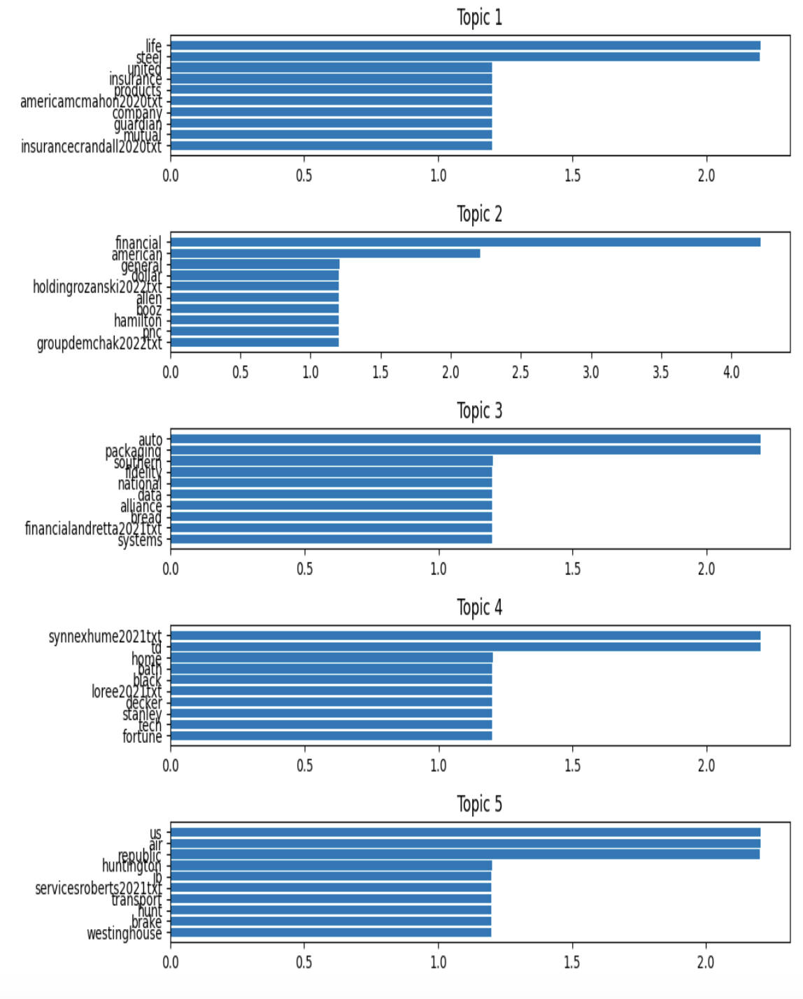

# Project Milestone 3

### Use Case:

**CEO Strategy Themes**:

**Objective**: Identify unique linguistic or thematic signatures of individual CEOs or companies.
**Possible Techniques**: Use topic modeling (e.g., BERTopic) and visualizations to explore different themes by company or industry (this would require you to map company to industries).

**Jupyter notebook of initial POC**: 
Each of the attached files represents a specific industry that was identified from the documents by our group and contains basic data exploration, sentiment analysis and topic modeling.

_See Project Milestone 3 document for further reflection_

## Write Up
**Progress since the last milestone**
Following the completion of our initial data preprocessing, we have made significant progress in identifying common themes/topics within the CEO letters to shareholders dataset. We employed BERTopic, a recently developed neural-based topic modeling technique, to automatically discover latent topics within the letters. We optimized our output by eliminating stopwords, punctuation, and numerical values- likely signifying years. This resulted in the identification of seven distinctive topics within our dataset. We analyzed the top keywords associated with each identified topic to gain a thematic understanding. Topics include financial growth and performance, employee health, company capital, etc. 

**Failed Ideas/Experiments**
Initially, we tried to identify common themes and topics in the dataset without the elimination of stopwords, punctuation, and numerical values. This returned less than desirable results as it primarily returned words such as “and, for, or” etc. 
For one of our experiments, we wanted to see if we could build a topic model for our consolidated dataset using a pre-trained model but filtering only financial terms into different topics. The objective of this experiment was to construct a model capable of generating word representations that encompass semantic similarities. This, in turn, would give us a better analysis of financial text data from our CEO Letter. 
We started by defining some “seed” words that would be used for filtering financial text (words like: ['financial', 'bank', 'economy', 'market', 'investment', 'revenue', 'profit', 'capital', 'asset', 'income', 'equity', 'debt', 'loan', 'stock', 'bond', 'dividend']). We then loaded a pre-trained model (word2vec-google-news-300) through the gensim API. Instead of training a Word2Vec model from scratch on our own dataset, we wanted to try a pre-trained model, which has already learned rich representations of financial words based on the patterns present in the training data. 
The utilization of the pre-trained Word2Vec model in our study involves computing the cosine similarity between tokens extracted from the text data and a predefined set of financial terms. 
Our findings yielded favorable outcomes, as we successfully derived five distinct topics related to financial concepts. These topics exhibit slight variations from one another, showcasing an understanding of financial terms. Moving forward, our intention is to further refine our model through experimentation with a more specialized dataset focused on a single industry. By doing so, we aim to enhance the quality of our results and achieve greater differentiation among topics, thereby enriching our understanding of the underlying financial narratives.

**Blockers**
During this process of experimenting with the parameters of our BERTopic models, we found that the modeling process could be particularly tedious, as some cells would take 2 minutes to run. This resulted in a lot of time we spent just waiting on our code to finish running since we frequently needed to adjust the parameters of the model to best fit the contents of each individual industry.
Beyond this, we did not run into any other consistent technical issues that were significant to the success of our project.

**Preliminary Results**
	The preliminary results of our modeling efforts were promising and continued to improve as we found ways to make the model better, like by excluding certain stopwords, years and any other unnecessary content. In some instances, we also made use of BERTopics ability to specify the number of topics so we could ensure that we were capturing all of the relevant trends within a particular corpus. Although our final results for each model were well-polished and for the most part, generally relevant to each industry that they pertained to, we still believe there is room for improvement and plan to continue development of these models or others like them to achieve more optimal results.

**Next Steps**
Refine Topic Interpretation: Continue refining our code to conduct a deeper analysis of keywords and potential subtopics within each identified theme.
Sentiment Analysis: Explore the sentiment associated with each topic across different years/industries with the code from our initial discovery.
External Events: Consider the possibility of correlating the content of our topics with external events or general trends of the years they originated from.
